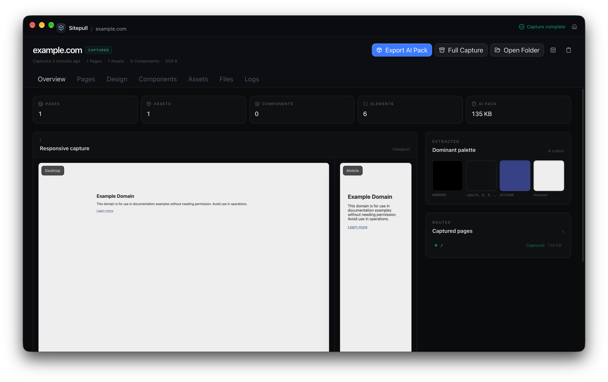

# Sitepull

[](https://github.com/isaiahneal/sitepull/actions/workflows/quality.yml)
[](https://github.com/isaiahneal/sitepull/actions/workflows/distribution.yml)
[](https://github.com/isaiahneal/sitepull/releases/latest)
[](LICENSE)

**Pull the web apart.** Sitepull is a desktop utility and headless CLI for macOS, Linux, and Windows. Give it a public website, and it uses a real browser to render the delivered implementation, crawl permitted routes, capture visual evidence, infer the design system, and produce an inspectable reference project for people and coding agents.

The output combines rendered HTML, semantic DOM summaries, delivered resources, responsive screenshots, computed design tokens, repeated component candidates, and a concise `AI_CONTEXT.md`. Export a compact AI Pack for ChatGPT, Codex, Claude, or another coding agent, or retain the Full Capture for deeper inspection.

> Sitepull captures and analyzes content delivered to a browser. It does not magically recover a website's private/original source repository.



## Highlights

- Hydrated, rendered HTML and visible semantic elements with reconstruction-focused computed styles
- Bounded breadth-first route crawling from the rendered DOM, with same-origin enforcement and recorded skip reasons
- Up to three attempts for retryable navigation failures, with bounded backoff and per-attempt evidence in page manifests and logs
- Desktop and mobile viewport/full-page screenshots, plus an optional tablet preset
- Browser-delivered HTML, CSS, JavaScript, images, SVG, fonts, JSON, manifests, and icons
- Resource-body safety budgets of 25 MiB per response, 512 MiB per capture, and three concurrent body reads by default
- SHA-256 asset deduplication with source URLs, status, size, local path, and referencing pages
- Evidence-backed color, typography, spacing, radius, shadow, breakpoint, and CSS-variable analysis, including valid signed margins
- Deterministic repeated DOM/style signatures surfaced as inferred component candidates
- Capture-coverage reporting in both `AI_CONTEXT.md` and the desktop Overview, including failed pages, unavailable resources, and retry recoveries
- AI Pack and Full Capture ZIP exports from both the desktop app and the shared core engine
- A native desktop inspector with searchable history, saved capture recipes, **Capture Again**, and Overview, Pages, Design, Components, Assets, Files, and Logs workspaces
- A first-class, script-friendly CLI that is headless by default

WebKit is the default and bundled desktop rendering engine. Chromium and Firefox are optional for CLI/source-development captures when their Playwright browser packages are installed.

## Get Sitepull

Desktop packages are published on the [GitHub Releases page](https://github.com/isaiahneal/sitepull/releases):

- macOS arm64: DMG and ZIP
- Ubuntu 24.04 x64: DEB and ZIP
- Windows x64: Squirrel Setup executable and ZIP

Each desktop package contains its own Playwright WebKit runtime. Release artifacts are built on their matching operating system so the embedded browser is native to that platform.

The community `v0.2.0` artifacts are not backed by Apple Developer ID, Microsoft Authenticode, or Linux repository signing. See [Distribution trust](#distribution-trust) before installing a release artifact.

## Requirements

Packaged desktop builds include Node/Electron and the matching Playwright WebKit runtime. Source development requires:

- Node.js `24.20.0` (current LTS line used by this release)
- pnpm `11.24.0`
- A supported macOS or Windows host, or Ubuntu 24.04 x64 for the packaged Linux desktop
- Xcode Command Line Tools for local macOS DMG creation
- `fakeroot` for local Ubuntu DEB creation

Chromium and Firefox are optional CLI/development engines and require their corresponding Playwright browser packages.

## Installation from source

Sitepull development uses Node.js 24 LTS and pnpm 11:

```bash
git clone https://github.com/isaiahneal/sitepull.git
cd sitepull
corepack enable
pnpm install
pnpm install:browsers
```

Launch the desktop app:

```bash
pnpm dev
```

Build and install the global CLI command:

```bash
pnpm install:cli-global
sitepull --version
```

The installer first creates a complete, versioned production CLI deployment in the operating system's per-user application-data directory. On macOS and Linux it points an idempotent `~/.local/bin/sitepull` link at that stable deployment; on Windows it creates a managed `sitepull.cmd` launcher in `%LOCALAPPDATA%\Microsoft\WindowsApps`, which is normally already on the per-user `PATH`. The command therefore survives moving or deleting the source checkout. The installer refuses to overwrite unrelated commands and reports if the selected directory is missing from `PATH`; `SITEPULL_BIN_DIR` can select another command directory. Once that directory is on the shell path, `sitepull` is available in macOS Terminal, Ghostty, PowerShell, Windows Terminal, and other new shells without a repository-relative path.

## Intelligent URL input

You can enter or pass a bare host:

```bash
sitepull pull example.com
```

For a bare host, Sitepull infers HTTPS and tests it first. It retries over HTTP only when that inferred HTTPS transport fails. An explicitly supplied `https://` URL is never silently downgraded. The final resolved URL is recorded in capture metadata.

The desktop input follows the same rule.

## CLI

Typical capture:

```bash
sitepull pull example.com --ai-pack --zip
```

Explicit headless automation:

```bash
sitepull pull example.com \
  --headless \
  --output ./reference \
  --depth 2 \
  --max-pages 25 \
  --engine webkit \
  --viewports desktop,mobile \
  --ai-pack \
  --zip
```

Headless is the default. Use `--headed` when you intentionally want to watch the Playwright browser; `--headless` and `--headed` are mutually exclusive.

Available options:

| Option                     | Purpose                                               |
| -------------------------- | ----------------------------------------------------- |
| `-o, --output <directory>` | Output parent; defaults to `~/Sitepull`               |
| `-d, --depth <number>`     | Maximum route depth; defaults to `2`                  |
| `-p, --max-pages <number>` | Maximum pages; defaults to `25`                       |
| `--engine <engine>`        | `webkit`, `chromium`, or `firefox`                    |
| `--viewports <presets>`    | Comma-separated `desktop,mobile,tablet` presets       |
| `--include-subdomains`     | Permit subdomains of the source host                  |
| `--headless`               | Explicitly run without a visible browser; the default |
| `--headed`                 | Show the Playwright browser                           |
| `--timeout <seconds>`      | Per-page timeout; defaults to `30`                    |
| `--zip`                    | Export a ZIP after capture                            |
| `--ai-pack`                | With `--zip`, export the compact AI Pack              |
| `--quiet`                  | Emit only the final artifact path                     |

Run `sitepull --help` for the complete command reference. Progress and summaries go to stderr while the final artifact path goes to stdout, making quiet mode suitable for scripts. Exit codes are `0` for success, `1` for capture failure, `2` for invalid usage, and `130` for cancellation.

## Desktop workflow

Run `pnpm dev`, enter a host or URL, adjust Advanced Settings if needed, and choose **Pull Site**. Sitepull reports real stage and counter events from the core engine rather than a simulated percentage. Cancellation stops the crawl and closes Playwright resources.

Sitepull saves the complete effective recipe for each new capture: normalized URL behavior, output parent, crawl settings, resource limits, and viewport list. Recent captures are searchable by host or URL, and **Capture Again** preloads the exact saved recipe for review before starting a fresh timestamped capture. The last-used recipe is restored on the new-capture screen; legacy `v0.1.0` history remains readable but has no invented recipe.

While the application process remains open, the renderer reconciles capture state with a bounded main-process event snapshot on load and when the window regains focus. Replayed and live events are merged by capture ID and sequence, closing UI delivery races without claiming that an interrupted capture can resume after the application quits.

The default desktop output parent is the platform Documents directory under `Sitepull`. A native folder picker can authorize another parent. Completed captures can be inspected across:

- **Overview** — capture health, retry recovery, HTTP/body resource gaps, element bounds, stylesheet access, screenshots, palette, typography, routes, candidates, and export estimates
- **Pages** — route browser with desktop/mobile and viewport/full-page toggles
- **Design** — colors, type, spacing, radii, shadows, and CSS variables
- **Components** — inferred repeated patterns with confidence and evidence
- **Assets** — categorized and filterable delivered resources
- **Files** — bounded, read-only project tree and text preview
- **Logs** — structured capture events and persisted logs

Recents are stored in the operating system's application-support directory. Missing or externally deleted captures degrade gracefully.

## Architecture

```text
sitepull/
├── apps/
│   ├── desktop/       Electron Forge + React/Vite desktop application
│   └── cli/           CAC-based `sitepull` command
├── packages/
│   ├── core/          Browser crawl, capture, analysis, project, and ZIP engine
│   └── contracts/     Shared strict Zod schemas and TypeScript contracts
├── fixtures/          Deterministic hydrated fixture website
└── tests/integration/ End-to-end browser crawl assertions
```

Both frontends invoke the same `@sitepull/core` engine. The core package has no Electron or React dependency. The Electron main process owns captures and filesystem access; the sandboxed renderer communicates through a narrow, contract-validated preload bridge.

## Capture output

Successful runs finalize atomically into a timestamped directory:

```text
example.com-2026-08-30T20-56-54Z-357710/
├── README.md
├── AI_CONTEXT.md
├── sitepull.json
├── manifest.json
├── pages/
│   └── home/
│       ├── rendered.html
│       ├── document.json
│       ├── elements.json
│       ├── links.json
│       ├── network.json
│       └── screenshots/
├── design/
├── assets/
├── raw/
└── logs/
```

Downloaded compiled JavaScript remains under `raw/javascript`; Sitepull never presents it as an original framework source tree. Explicitly referenced source maps may be captured. Sitepull does not guess hidden `.map` paths.

## AI Pack and Full Capture

**AI Pack** is a deliberately compact evidence set containing `AI_CONTEXT.md`, manifests, design analysis, rendered HTML, useful DOM summaries, screenshots, and selected visual assets. It excludes minified bundles, raw fonts, duplicate binaries, and verbose network logs. Near the top, `AI_CONTEXT.md` reports capture coverage: attempted and captured pages, retry recoveries, failed routes, captured and unavailable resources, and representative resource gaps. This makes partial evidence explicit before a coding agent treats the pack as complete.

**Full Capture** preserves every successfully captured project file, including raw delivered resources and structured logs. The AI Pack uses an explicit file allowlist; both modes estimate compressed size before export and create ZIPs without following links outside the capture root.

## Security model

Crawled websites are hostile input.

- Only the isolated Playwright browser executes target-site JavaScript. Captured code is never loaded into Sitepull's renderer.
- Electron uses `nodeIntegration: false`, context isolation, a sandboxed renderer, web security, restrictive CSP, disabled permissions, and denied webviews/navigation.
- The preload bridge exposes only typed Sitepull operations. Every IPC request/result is parsed with shared Zod contracts, and each sender is matched to the trusted main frame.
- The renderer cannot select arbitrary paths or invoke shell commands. Output parents are the default directory or explicitly authorized through a native picker.
- Canonical path containment rejects traversal and symbolic-link escapes. Text previews, project trees, and screenshot delivery are size-bounded.
- PNG screenshots are checked for valid dimensions and decoded-pixel limits both after capture and before renderer delivery.
- Browser HTTP(S)/WebSocket traffic and native source-map downloads resolve through Sitepull, reject non-public address sets, and pin the validated addresses into the actual upstream sockets. WebRTC and WebTransport are disabled; WebKit page workers are also disabled because their network transports do not obey an HTTP proxy.
- Crawling is same-origin by default. Subdomains require opt-in; authentication, CAPTCHA, paywall, and access-control bypasses are intentionally out of scope.

See [SECURITY.md](SECURITY.md) for vulnerability reporting.

## Development and quality gates

The repository pins Node `24.20.0` and pnpm `11.24.0` in `.node-version` and `package.json`; `pnpm-lock.yaml` freezes the resolved application and tool dependency graph.

```bash
pnpm typecheck
pnpm lint
pnpm format:check
pnpm test
pnpm test:integration
pnpm build:cli
pnpm build:desktop
```

The deterministic fixture exercises hydrated SPA routes, lazy content, query bounding, origin enforcement, repeated cards, responsive CSS, signed margins, variables, local fonts, SVG and duplicate raster resources, source maps, screenshots, retry recovery and evidence, resource budgeting, project generation, AI coverage, HTTP fallback, and cancellation cleanup.

## Packaging

Install the workspace dependencies first. Packaging downloads an app-local WebKit bundle and embeds it in the desktop artifact.

```bash
# Unpacked application for the current platform
pnpm package:desktop

# Native distributables
pnpm make:mac
pnpm make:linux
pnpm make:windows
```

Platform-specific unpacked builds are also available through `pnpm package:mac`, `pnpm package:linux`, and `pnpm package:windows`. Forge writes output below `apps/desktop/out/`.

Build each target on its native operating system. The repository's distribution workflow does exactly that for macOS, Ubuntu Linux, and Windows. Distribution waits for the reusable quality workflow and verifies that a release tag exactly matches `package.json` plus a nonempty versioned release-notes file before any native build begins. External workflow actions are pinned to immutable commits. Each runner then verifies its expected maker outputs, Electron fuse state, the packaged app's own Playwright module resolution, embedded WebKit launch, preload/IPC bridge, and renderer startup; macOS also verifies the bundle's internal ad-hoc signature consistency. The Linux gate additionally installs the generated DEB in a pristine Ubuntu 24.04 container and launches its packaged runtime. macOS DMG creation requires Xcode Command Line Tools; Ubuntu DEB creation requires `fakeroot`; Windows Squirrel creation runs on Windows.

## Distribution trust

Electron fuses harden every package. Local macOS packages are re-signed ad hoc after fuse mutation and verified for internal signature consistency, but ad-hoc signing is not an Apple Developer ID signature and cannot be notarized. The community artifacts do not claim hardened runtime, and Sitepull does not weaken the bundle with the disable-library-validation entitlement. A hardened-runtime, notarized macOS distribution requires an Apple Developer identity and notarization credentials.

Windows packages likewise require an Authenticode certificate for publisher trust, and Linux packages require a repository/package-signing workflow for signed distribution. Those private credentials are intentionally absent from this public repository and its `v0.2.0` community builds.

For tagged releases produced by the current workflow, GitHub Actions generates `SHA256SUMS.txt`, verifies that it covers and matches every staged asset before publication, and records Sigstore-backed SLSA provenance attestations for every native asset and for the checksum manifest itself. After downloading an asset, verify its provenance with GitHub CLI:

```bash
gh attestation verify ./Sitepull.dmg \
  --repo isaiahneal/sitepull \
  --signer-workflow isaiahneal/sitepull/.github/workflows/distribution.yml
```

An attestation proves which repository and workflow produced the exact bytes; it does not replace operating-system publisher signing or establish that the software is vulnerability-free.

## Known limitations

- Sitepull reconstructs public browser output; it cannot recover private repositories, server templates, unshipped assets, build configuration, or backend code.
- Cross-origin stylesheet rules can be opaque to in-page CSS inspection, although delivered stylesheets may still be captured as resources.
- Content behind login, anti-bot controls, CAPTCHAs, paywalls, or private-network hosts is currently intentionally unsupported.
- Playwright WebKit is useful for Safari-adjacent behavior, but it is not the Safari application.
- Packaged desktop builds intentionally embed only WebKit; Chromium and Firefox remain optional CLI/source-development engines.
- The packaged Linux desktop is targeted and clean-install tested on Ubuntu 24.04 x64. An RPM is intentionally not published: Playwright's embedded WebKit build targets Ubuntu ABIs that current Fedora repositories cannot satisfy honestly.
- WebKit page workers are disabled during capture so worker-only WebTransport cannot bypass the validated HTTP proxy. Sites that require dedicated/shared workers for rendering may lose that worker-driven behavior; Chromium and Firefox instead use engine-level non-proxied transport restrictions.
- Resource-body capture defaults to 25 MiB per response, 512 MiB across the capture, and three concurrent body reads. Responses without a trustworthy content length still require one complete in-memory Playwright buffer before their actual size can be enforced.
- Responsive screenshots reuse one stabilized page and resize it through the configured viewports. DOM/computed-style evidence is extracted at the first configured viewport, so JavaScript or server behavior selected only during an initial viewport-specific load requires a separate capture.
- Component names and semantic design roles are deterministic inferences. Raw measurements, frequencies, routes, and signatures remain available for downstream judgment.
- Official publisher signing, macOS hardened runtime, and notarization are not configured for the public `v0.2.0` artifacts. GitHub attestations establish workflow provenance, not publisher identity.

## License

[MIT](LICENSE) © Isaiah Neal
